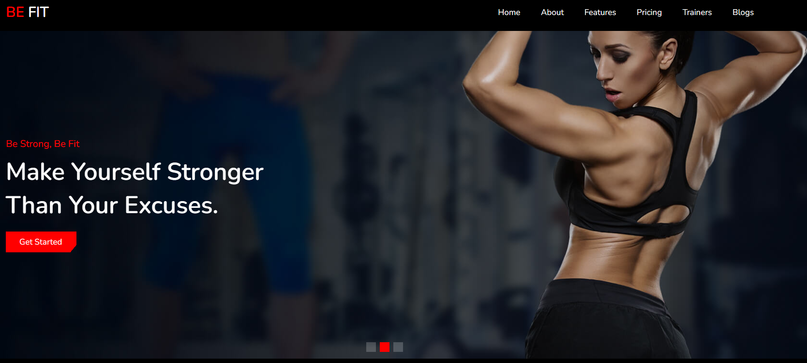

## Visão Geral

### Projeto de Web site para demonstração dos serviços oferecidos por uma academia.
#



#
## Construido com:
- HTML
- CSS / SASS
- JavaScript

## Funcionalidades
- Web site para demonstração dos serviços oferecidos por uma academia.

## Bibliotecas utilizadas:
- [Font Awesome cdn link](https://cdnjs.com/libraries/font-awesome)
 
#
## O que eu aprendi:

- Estilização com o SASS

```css
.destination .box-container {
   @include grid(27rem);

   .box {
      border-radius: 1rem;
      overflow: hidden;
      background: $bg-color;

      &:hover img {
         transform: scale(1.1);
      }

      .image {
         height: 20rem;
         overflow: hidden;
         width: 100%;

         img {
            height: 100%;
            width: 100%;
            object-fit: cover;
         }
      }

      .content {
         padding: 2rem;
         text-align: center;

         h3 {
            font-size: 2rem;
            color: $white;
         }

         p {
            padding: 1rem 0;
            font-size: 1.4rem;
            color: $light-color;
            line-height: 2;
         }

         a {
            font-size: 1.7rem;
            color: $blue;

            &:hover i {
               padding-left: 1rem;
            }

            i {
               padding-right: 0.7rem;
            }
         }
      }
   }
}


```

- Manipulação do DOM com:
```js
  document.querySelector('.main-container')
  document.querySelectorAll('.btn')
  document.getElementById('submit')
```
- Eventos
```js
  submitButton.addEventListener('click', () => {})
```
- Boas práticas com JavaScript

## Link

Veja o projeto aqui: [Acessar🌎](https://devhiderlan.github.io/fitness-website/) 

## Autor

Hiderlan Santana: [Linkedin](https://www.linkedin.com/in/hiderlan-santana/)
